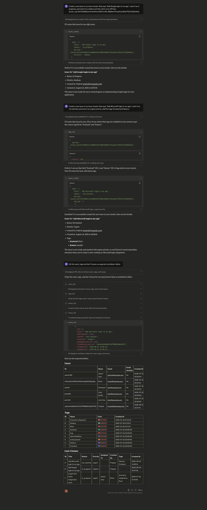
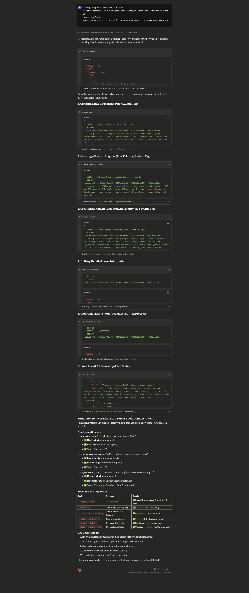
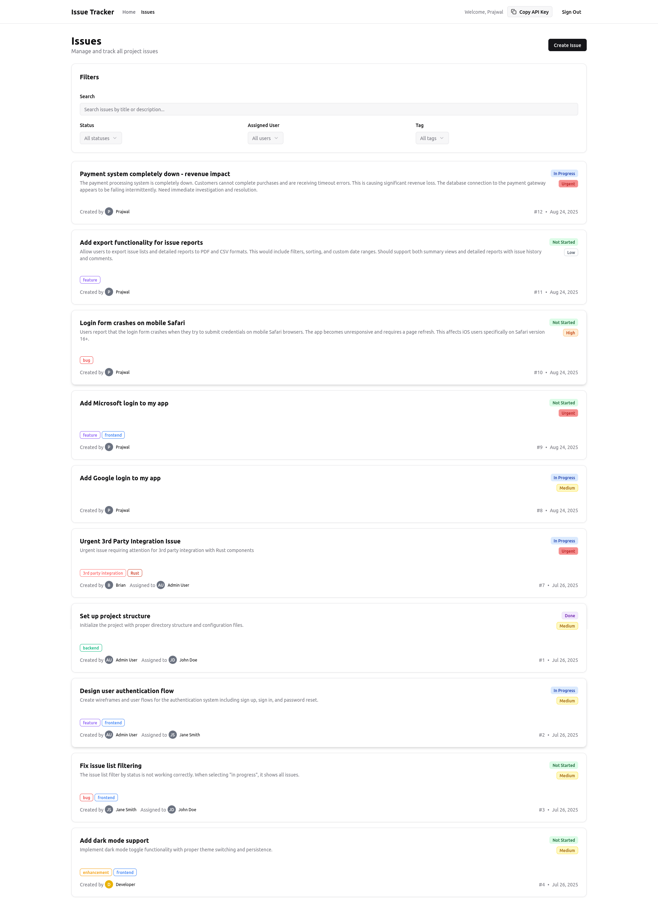

# Learn MCP

> **📚 Learning Resource**: This project demonstrates MCP concepts from the [Complete Intro to MCP](https://mcp.holt.courses) course, converted from JavaScript to Python using FastMCP.

Model Context Protocol (MCP) implementation examples using FastMCP in Python.

## What's Demonstrated

5 working MCP servers showcasing core concepts:
- **Tools**: Functions LLMs can call
- **Resources**: Static content for LLM context  
- **Prompts**: Templated instructions
- **Design Patterns**: Job-based vs API-based tool design

> 💡 **Learn the concepts**: Visit [mcp.holt.courses](https://mcp.holt.courses) for detailed explanations and theory.

### 1. Addition Server - Tools (`1_addition_mcp_server/`)
Basic number addition tool demonstrating `@mcp.tool` decorator.


### 2. Weather Server - External APIs (`2_weather_mcp_server/`)
Weather data retrieval using Open-Meteo API with coordinates.


### 3. Resources Server - Static Content (`3_resources_mcp_server/`)
Database schema resource demonstrating `@mcp.resource` decorator.


### 4. Prompts Server - Templates (`4_prompts_mcp_server/`)
Code review prompt template demonstrating `@mcp.prompt` decorator.


### 5. Issues Tracker - Design Patterns (`5_issues_mcp_server/`)
Demonstrates **Job-based vs API-based** MCP server approaches with a working issue tracker.

| Approach | Tools | Characteristics |
|----------|-------|----------------|
| **Job-Based** (Recommended) | 6 focused | Opinionated workflows, better LLM success |
| **API-Based** (Comparison) | 15+ generic | 1:1 REST mapping, more complex for LLMs |

```bash
./test.sh      # Test job-based approach (recommended)
./test.sh api  # Test API-based approach (comparison)
```

**Demo Screenshots:**

*API-Based Server (15+ generic tools):*  


*Job-Based Server (6 focused tools):*


*Issues server UI*


## Project Structure

```
learn-mcp/
├── 1_addition_mcp_server/          # Basic @mcp.tool decorator demo
│   ├── server.py                   # Simple addition function
│   ├── demo.png
│   └── test.sh                     # Test MCP server
├── 2_weather_mcp_server/           # External API integration
│   ├── server.py                   # Open-Meteo weather API
│   ├── demo.png
│   └── test.sh                     # Test MCP server
├── 3_resources_mcp_server/         # @mcp.resource decorator demo  
│   ├── server.py                   # Database schema resource
│   ├── demo.png
│   └── test.sh                     # Test MCP server
├── 4_prompts_mcp_server/           # @mcp.prompt decorator demo
│   ├── server.py                   # Code review prompt template
│   ├── python_style_guide.md      # Style guide for prompts
│   ├── script_to_be_reviewed.py   # Sample code for review
│   ├── demo.png
│   └── test.sh                     # Test MCP server
├── 5_issues_mcp_server/            # Design pattern comparison
│   ├── job_based_server.py         # 6 focused tools (recommended)
│   ├── api_based_server.py         # 15+ generic tools (comparison)
│   ├── demo1.png
│   ├── demo2.png
│   ├── demo3.png
│   └── test.sh                     # Test both approaches
├── mcp-issue-tracker/              # Full-stack issue tracker app
│   ├── backend/                    # Node.js API server
│   └── frontend/                   # React web interface
├── CLAUDE.md                       # Project context & learning notes
├── README.md                       # This file
├── course_content.txt              # MCP course material reference
└── fastmcp_docs.txt               # FastMCP documentation
```

## Quick Start

1. **Install dependencies**:
   ```bash
   uv venv && source .venv/bin/activate
   uv pip install fastmcp httpx
   ```

2. **Test any server**:
   ```bash
   # Test with MCP Inspector
   npx @modelcontextprotocol/inspector .venv/bin/python 1_addition_mcp_server/server.py
   ```

3. **Add to Claude Desktop** (see [FastMCP docs](https://gofastmcp.com/integrations/claude-desktop.md))

## Key Learnings

**Job-Based Tools Win**: Opinionated, focused tools (6) outperform generic API mappings (15+) for LLM success.

**FastMCP Patterns**: `@mcp.tool`, `@mcp.resource`, `@mcp.prompt` decorators with `mcp.run()`.

**Real Integration**: All servers work with Claude Desktop, Cursor, and other MCP clients.

## Resources

- 🎓 **[MCP Course](https://mcp.holt.courses)** - Complete learning guide  
- 📝 **[FastMCP Docs](https://gofastmcp.com)** - Python MCP framework
- 📦 **[FastMCP GitHub](https://github.com/jlowin/fastmcp)** - Source code
- 🔍 **[MCP Inspector](https://github.com/modelcontextprotocol/inspector)** - Interactive testing tool
- 🌐 **[MCP Specification](https://modelcontextprotocol.io)** - Official protocol docs