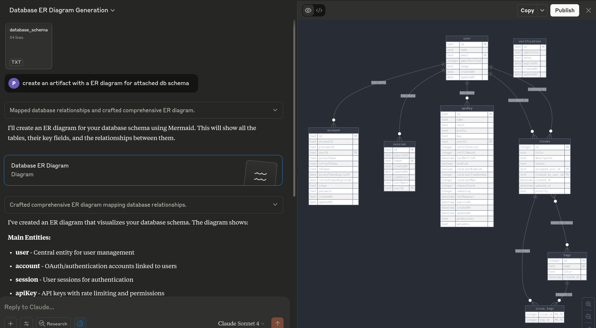
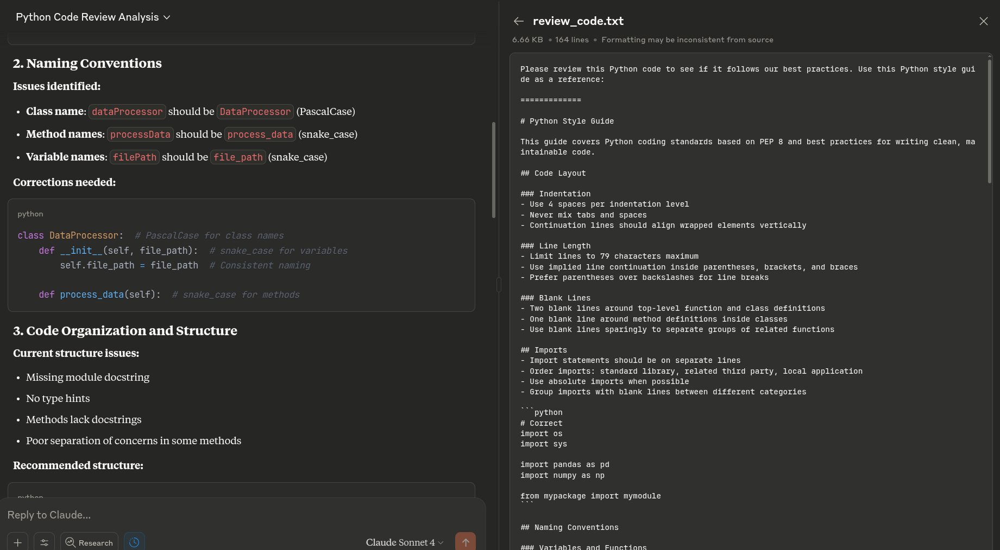

# Learn MCP

Learning Model Context Protocol (MCP) using FastMCP in Python.

## MCP Servers

Each server is organized in its own folder containing:
- `server.py` - MCP server implementation
- `test.sh` - JSON-RPC testing script  
- `demo.png` - Screenshot demonstration

### 1. Addition Server (`1_addition_mcp_server/`)
Basic number addition tool demonstrating MCP tools functionality.

### 2. Weather Server (`2_weather_mcp_server/`)
Weather data retrieval using Open-Meteo API with latitude/longitude coordinates.

### 3. Resources Server (`3_resources_mcp_server/`)
Database schema resource demonstrating MCP resources functionality.

### 4. Prompts Server (`4_prompts_mcp_server/`)
Code review prompt template demonstrating MCP prompts functionality.

## Key Concepts

- **Tools**: LLM decides when to call tools autonomously
- **Resources**: User provides static content to LLM manually (via ➕ button)
- **Prompts**: User provides templated instructions to LLM (via ➕ button)
- **Resources are static** - no input parameters, **Prompts are dynamic** - accept parameters
- **Read-only database connections** - safer for resources to prevent accidental modifications

## Technical Notes

- **Claude Desktop logs**: `~/.config/Claude/logs/`
- **Tool Design**: Avoid unnecessary tools - they confuse LLMs and increase context usage

## References

- [MCP Course](https://mcp.holt.courses)
- [FastMCP Documentation](https://gofastmcp.com)
- [FastMCP GitHub](https://github.com/jlowin/fastmcp)