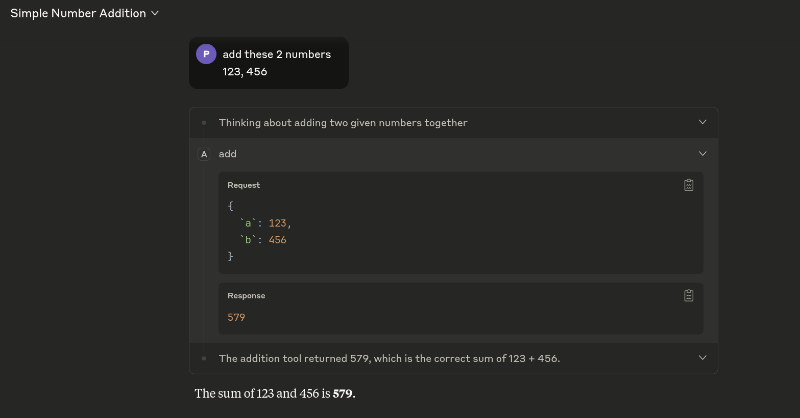
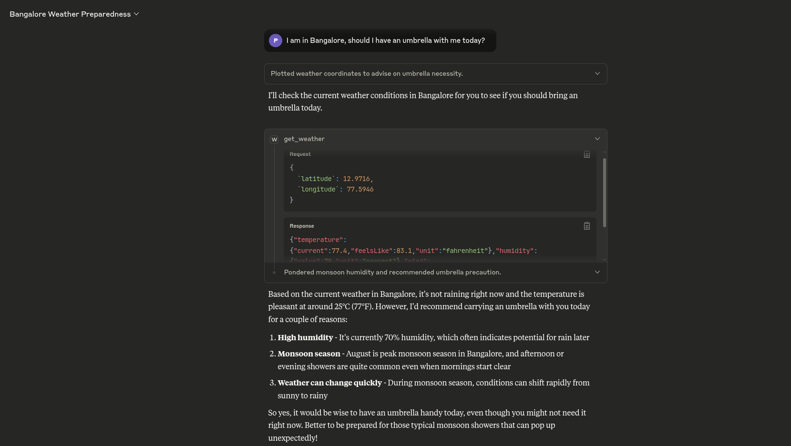

# Learn MCP

Learning Model Context Protocol (MCP)  using fastmcp.

## MCP Servers

Each server is organized in its own folder containing:
- `server.py` - The MCP server implementation
- `test.sh` - JSON-RPC testing script  
- `demo.png` - Screenshot demonstration

### 1. Addition Server (`1_addition_mcp_server/`)
Simple number addition tool for testing MCP functionality.

### 2. Weather Server (`2_weather_mcp_server/`)
Weather data retrieval using Open-Meteo API with latitude/longitude coordinates.

## Notes

- **Claude Desktop logs**: `~/.config/Claude/logs/`
- **Tool Design**: Avoid unnecessary tools - they confuse the LLM and increase context usage

## References

- [MCP Course](https://mcp.holt.courses)
- [FastMCP Documentation](https://gofastmcp.com/llms.txt)
- [FastMCP GitHub](https://github.com/jlowin/fastmcp)