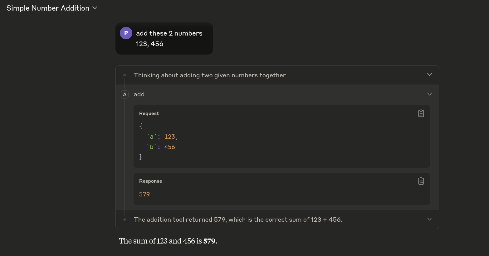
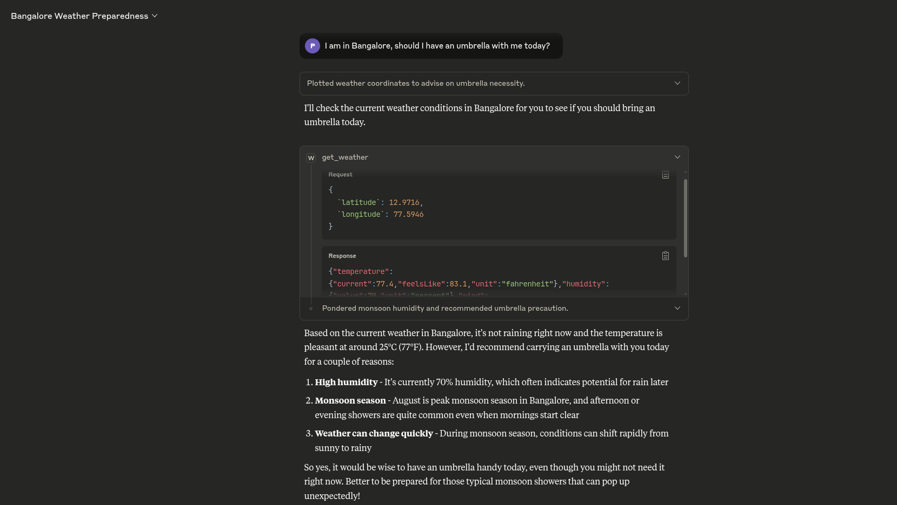

# Learn MCP

Learning Model Context Protocol (MCP)  using fastmcp.

## MCP Servers

### 1. Addition Server
Simple number addition tool for testing MCP functionality.

### 2. Weather Server  
Weather data retrieval using Open-Meteo API with latitude/longitude coordinates.

## Notes

- **Claude Desktop logs**: `~/.config/Claude/logs/`
- **Tool Design**: Avoid unnecessary tools - they confuse the LLM and increase context usage