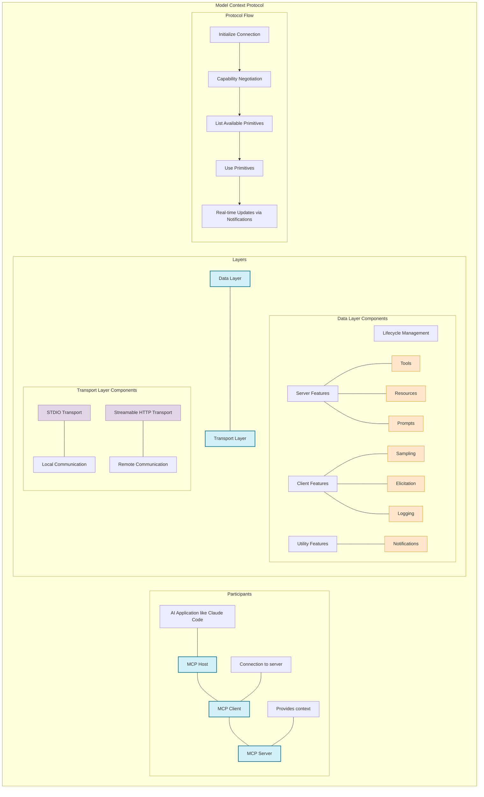

```mermaid
graph TB
    subgraph "Model Context Protocol"
        subgraph "Participants"
            MH[MCP Host] --- MC[MCP Client]
            MC --- MS[MCP Server]
            note1[AI Application like Claude Code] --- MH
            note2[Connection to server] --- MC
            note3[Provides context] --- MS
        end

        subgraph "Layers"
            DL[Data Layer] --- TL[Transport Layer]
            
            subgraph "Data Layer Components"
                LM[Lifecycle Management]
                SF[Server Features]
                CF[Client Features]
                UF[Utility Features]
                
                SF --- Tools[Tools]
                SF --- Resources[Resources]
                SF --- Prompts[Prompts]
                
                CF --- Sampling[Sampling]
                CF --- Elicitation[Elicitation] 
                CF --- Logging[Logging]
                
                UF --- Notifications[Notifications]
            end
            
            subgraph "Transport Layer Components"
                STDIO[STDIO Transport]
                HTTP[Streamable HTTP Transport]
                
                STDIO --- LocalComm[Local Communication]
                HTTP --- RemoteComm[Remote Communication]
            end
        end
        
        subgraph "Protocol Flow"
            Init[Initialize Connection] --> Cap[Capability Negotiation]
            Cap --> List[List Available Primitives]
            List --> Use[Use Primitives]
            Use --> Update[Real-time Updates via Notifications]
        end
    end

    classDef primary fill:#d4f1f9,stroke:#05728f,stroke-width:2px
    classDef secondary fill:#ffe6cc,stroke:#d79b00,stroke-width:1px
    classDef tertiary fill:#e1d5e7,stroke:#9673a6,stroke-width:1px
    
    class MH,MC,MS primary
    class DL,TL primary
    class Tools,Resources,Prompts,Sampling,Elicitation,Logging,Notifications secondary
    class STDIO,HTTP tertiary
```